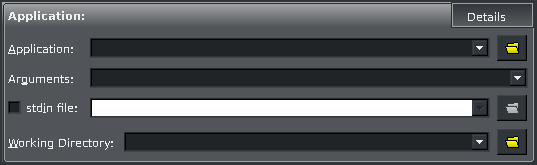
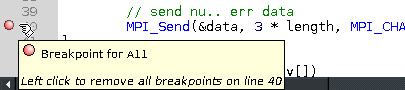
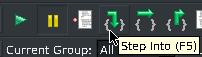
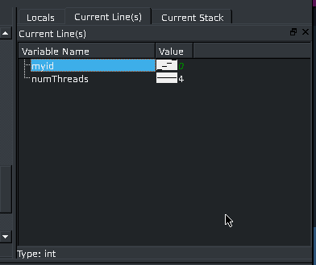
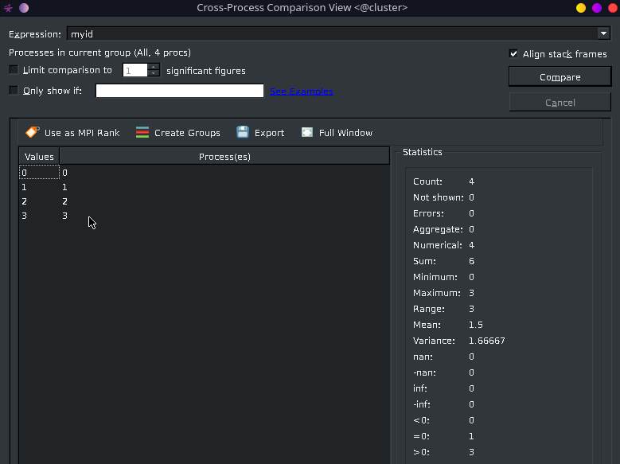
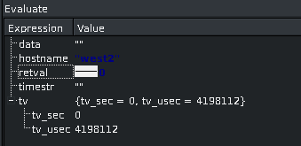
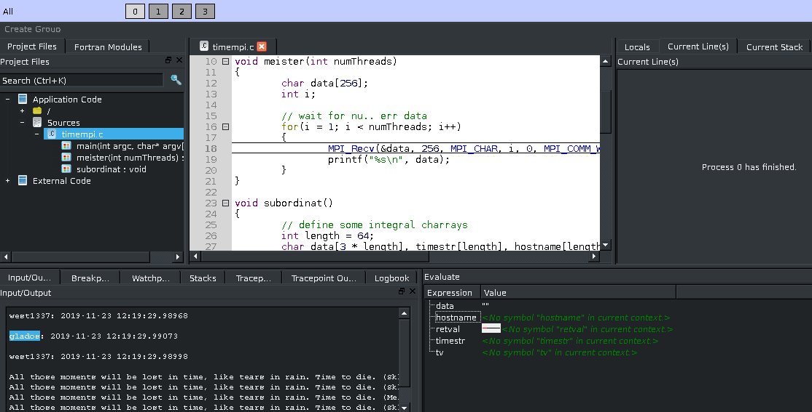
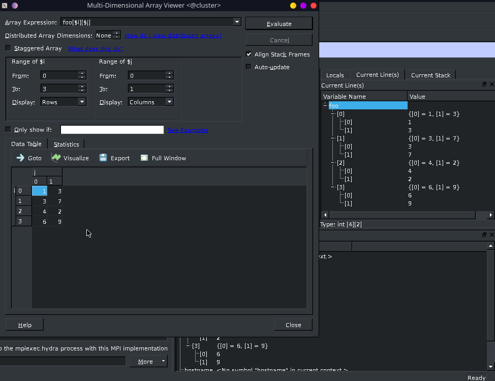
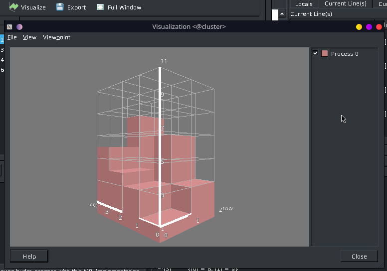

Hochleistungsrechnen im WiSe 2019/2020 - Übungsblatt 6 

## Paralleles Debugging mit DDT

> Wie kann man in DDT die Programmparameter angeben?

In dem Textfeld hinter "Arguments:" können Programmparameter angegeben werden.
Es ist außerdem möglich eine Datei anzugeben die als Standard-Eingabe verwendet werden soll.

> Setzen Sie in einer Zeile einen Breakpoint.

Mit einem Linksklick lässt sich ein Breakpoint setzen.

> Welche Step-Möglichkeiten gibt es und wie unterscheiden sich diese?

- Step Into

  Wenn eine Funktion aufgerufen wird, wird diese betreten. Andernfalls wird der Programmablauf bis zur nächsten Zeile/zum nächsten Abschnitt fortgeführt.

- Step Over

  Der Programmablauf wird bis zur nächsten Zeile/zum nächsten Abschnitt fortgeführt.

- Step Out

  Der Programmablauf wird bis zum Ende der aktuellen Funktion fortgeführt.

> Schauen Sie sich die Werte der Variable an, in der Sie den Rang des aktuellen Prozesses gespeichert haben. Was fällt Ihnen in der Darstellung auf? Vergleichen Sie die Werte aller Prozesse mit Hilfe des Rechtsklickmenüs.

Vor dem Wert ist eine kleine Abbildung, welche verdeutlicht, dass sich der Wert je nach Prozess unterscheidet.

> Machen Sie sich mit der Funktion des Evaluate-Fensters in der rechten unteren Ecke vertraut.

Evaluate zeigt den Wert/das Ergebnis eines Ausdrucks. Hier ist Prozess 2 ausgewählt.

> In der oberen Leiste finden Sie eine Übersicht aller Prozesse und Threads Ihres Programmes. Wechseln Sie zwischen den einzelnen Prozessen und beobachten Sie das Evaluate-Fenster.

In der oberen Leiste ist es möglich den angezeigten Prozess auszuwählen hier ist Prozess 0 ausgewählt. Die Ausgaben im Evaluate-Fenster passen sich entsprechend an den Prozess/Kontext an.

> Erweitern Sie Ihr Programm um ein Array und initialisieren Sie es mit beliebigen Zahlenwerten. Lassen Sie sich die Werte anzeigen. Welche sonstigen Visualisierungsmöglichkeiten bietet DDT? (Hinweis: Das Array wird nur für diese Aufgabe benötigt und soll in den abgegebenen Programmen `timempi` bzw. `timempi2` nicht enthalten sein.)

Es ist zum Beispiel möglich die Array-Struktur in einer Baum-Ansicht aufzuklappen oder eine Tabelle generieren zu lassen.

Außerdem ist es auch möglich, die Werte visuell darstellen zu lassen.

